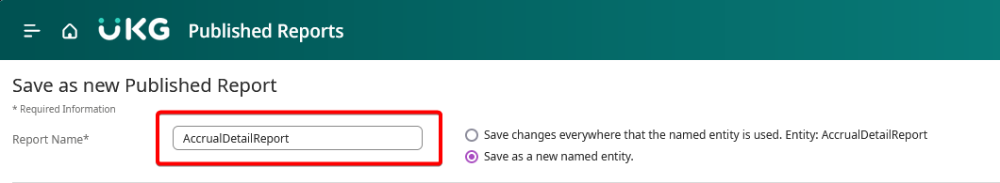
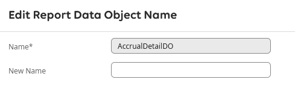

In order to modify a Standard report, the report must be duplicated first, which will turn the report into a Custom
report that can then be edited.

## Duplicating a Report

To duplicate a Standard report, navigate to **Published Reports** in **Application Setup** by going to **Application
Setup > Common Setup > Published Reports**. Find the Standard report you would like to modify, select it in the table
and click "Edit".

:::warning

Standard Read-Only reports cannot be modified.

:::

Once the Report Options screen loads, select the radio button labeled "Save as a new named entity". This will make the
"Report Name" field enabled. Create a new, unique name for the report. It may also be a good idea to change the label so
it is distinguishable from the original in the Report Library. You may also consider changing the category to "Custom
Reports" to further identify it as your own custom report.

:::info

You may also change the available output formats, category and default output type for your new report. However, it is
recommended that the defaults are left as-is.

:::

After setting the new report name and modifying any other fields, scroll down the page until the "Report Data Object
Name" section. There will be a table with each row corresponding to one Report Data Object (RDO) that is used in the
report. Most will only have one. Select the RDO in the table and click "Edit". This will open the "Edit Report Data
Object Name" window that will prompt you to enter a new name.

After entering the new name, click "Save". The report should now be ready to save as a copy. Scroll back up and click
"Save". Your new report will now appear on the "Published Reports" page and ready to edit as a new Custom report.
