import { CircleX, Pencil, Wrench } from "lucide-react";

:::warning

Crosstab reports are generally less performant than standard table reports. This is a limitation of this type of report. Additionally, crosstab reports have other limitations that standard table reports do not have. However, they can still be a good choice when needing to organize and return your data in a specific way.

:::

:::info

This article assumes there is already an existing report design created in BIRT Studio. If you need help creating a new report design, please refer to the [getting started](/docs/birt-studio/getting-started) guide.

:::

## Adding a Crosstab Report

To get started with a crosstab report, add the "Crosstab" table to your design by:

1. Selecting "Insert" from the top file menu.
2. Hover over "Table" and select "Crosstab" from the dropdown menu.

A blank "Crosstab Builder" window will appear.

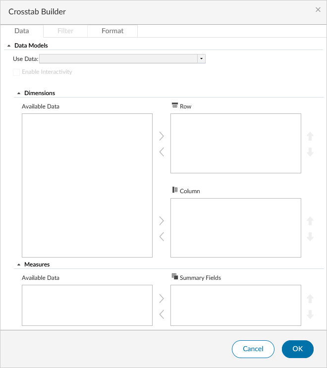

### Select the Data Source

From the "Use Data" dropdown, select the data source you want to use for the crosstab report by finding it in the dropdown and clicking on it's "Data Model". This can be any RDO that is currently in your report design.

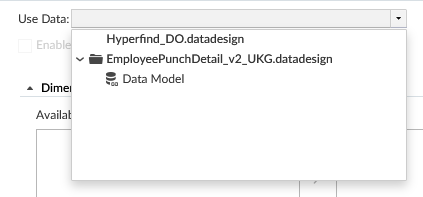

Once the "Data Model" is selected, the "Available Data" pane will populate with the "BaseDataSet" folder. This can be expanded and collapsed to show/hide the columns available in the data source.

### Adding Rows, Columns and Summary Fields

Once you have selected the RDO to use in the crosstab table, it's time to start building it out by adding in rows, columns and summary fields. These are what define a crosstab report.

:::info Clarification

All elements that are included in an RDO are called "columns". For the purposes of creating a crosstab report, we must make the distinction between RDO columns and crosstab "Columns". This is because the names are somewhat used interchangably during the creation process. For clarity, lowercase _column_ is referring to an RDO element and capitalized _Column_ is referring to a crosstab Column.

:::

#### Rows

RDO columns that are added as a "Row" will be added going across the table. Generally, the best columns to add as a Row will be static data, or data that does not change over time. However, this is a general rule of thumb and not necessarily always the case. It will require some experimenting to determine what fits best for your use case. As an example of how rows will appear with no other columns added, the following configuration produces the resulting output.

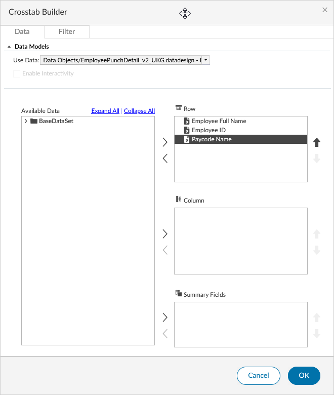

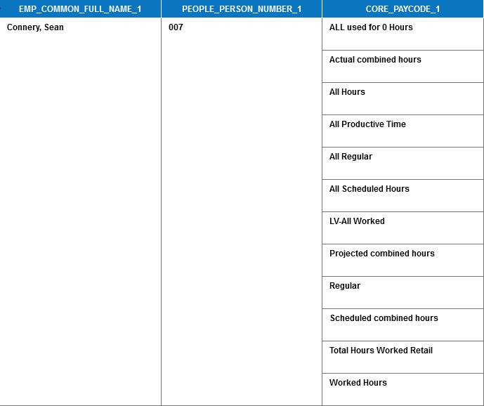

In this case, you can see the columns "Employee Full Name" (EMP_COMMON_FULL_NAME_1) and "Employee ID" (PEOPLE_PERSON_NUMBER_1) are displayed only once in the row, but the column "Paycode Name" (CORE_PAYCODE_1) displays one row for many Paycodes. This is because the employee listed earned all of those Paycodes in the specified time period.

:::info

Your results may look different, and not all columns that are added as a Row will display the same as the "Paycode Name" column added here. Crosstab Rows can also be distinguished by the empty cell directly above the column header when there is a Summary Field added.

:::

:::tip

The column header names can be changed and the cells formatted. This will be covered in a later section.

:::

#### Columns

RDO columns that are added as a Column will be added going across the top of the table. They are placed _above_ the Row column headers when a Summary Field is included. When there are no Summary Fields added, they will appear as column headers similar to that of a Row field. It is unlikely that your Crosstab report would have no Summary Fields, but it is worth mentioning. Using the same 3 columns as the previous example, with "Paycode Name" added as a Column, will look like below.

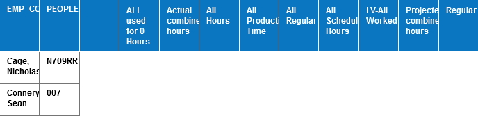

Again, the Paycodes return one Column for each Paycode. Multiple Columns can be added by moving more columns over from the left side. Subsequent columns will be added to the list and can be moved up and down in the hierarchy by clicking the up and down arrows to reorder them. In this example, you can see that the Paycode Name is on top of the "Apply Date" column.

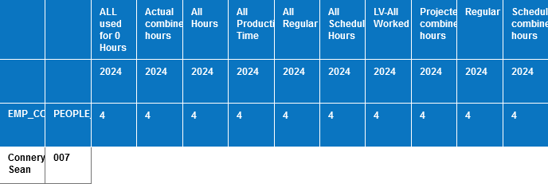

:::info

The "Apply Date" column is a Date type column and by default is grouped by the Year and Quarter. This screenshot was taken in the 4th quarter of 2024, so the "Apply Date" column is displaying the 4th quarter of 2024. This is a default behavior of the crosstab report and can be changed by modifying the column properties. Modifying the Date Grouping will be covered in a later section.

:::

:::info

Additional Columns will be displayed in the design as a new column header and placed underneath the first one that was added. They will also appear this way in the report design like above.

:::

#### Summary Fields

A Summary Field is a field that is added to the crosstab report that will display a value for each cell in the crosstab. This is the most important part of the crosstab report, as it is what will display the data that you are looking for. Continuing with the same example, adding the "Actual Hours" (TIMECARD_TRANS_ACTUAL_HOURS_1) column as a Summary Field will produce the following output.

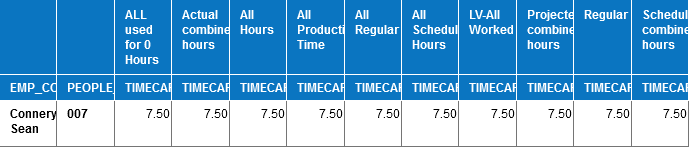

Multiple Summary Fields can be added and will be displayed underneath the Column(s) where the Column appears as a merged column across the entire width of the Summary Fields. This is best illustrated with an image like below where "Actual Wages" (TIMECARD_TRANS_ACTUAL_WAGES_1) was added as a second Summary Field.

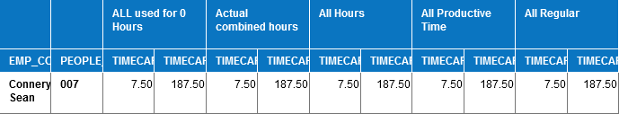

The Summary Fields can be reordered by clicking the up and down arrows to the right of the field name. This will move the field up or down in the hierarchy of the Summary Fields. Instead of moving the field up and down like moving a Column does, it will instead reorder it from left to right, within the Column.

The Summary Fields default to "Sum" by default. The full list of available functions are:

- Sum
- Average
- Median
- Standard Deviation
- Variance
- Mode
- First
- Last
- Count
- Max
- Min
- Count Distinct

Once you are satisfied with your choices, click **OK** to save the changes to the Crosstab Builder and generate the crosstab table. After the table is generated, you can now use the Analyze function to further customize the crosstab report.

## Using the Analyze Function

To open the "Interactive Crosstabs" window, right-click on the crosstab table and select "Analyze" from the context menu. This will open the "Interactive Crosstabs" window where you can further customize the crosstab report.

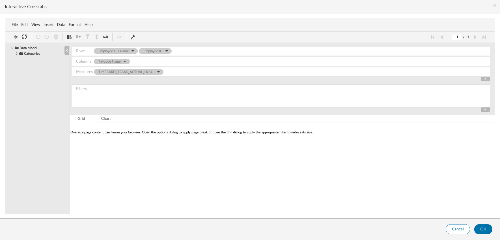

From this window, you are able to add columns as Rows, Columns or Measures (Summary Fields), apply filters, generate totals and subtotals across Measures, format column headers, and more.

### Formatting

The first thing you may want to do when in this window is to change the text of the column headers from their RDO key names to something more readable. To do this, right click on the column header cell and click "Change Text". This will let you edit the text to something else.

The "Format" context menu will change depending on the cell that you select. For example, selecting a cell that has data in it will present different options such as those you'd find when formatting data within a standard table like Font, Format Data and Conditional Formatting.

:::tip

You can also select any cell, and click the "Format" option from the file menu to explore available formatting options as well.

:::

Cells and columns can be formatted in other ways as well such as changing the width, setting the alignment, formatting how the data appears or adding conditional formatting. These are all covered in the [Editing and Formatting](/docs/birt-studio/customizing-reports/formatting-reports#formatting-data) guide.

### Filtering

Filtering can be done by dragging a column to the "Filters" area. A tooltip will display with a green checkmark or a red "X" indicating whether or not the column can be added as a filter. Most fields can be added as filters.

After dragging a column to the "Filters" area, a "Filter" window will open asking you to select a condition. The same [filter conditions](/docs/birt-studio/customizing-reports/filtering#filter-conditions) are available as when filtering in a standard report table.

Once the changes are saved by clicking **OK**, the filter will appear in the "Filters" area with the column name, condition and value in a row. There is also a <CircleX className="icon" /> and <Pencil className="icon" /> to delete and edit the filter, respectively.

### Computed Measures

To add a computed measure, from the file menu, select **Insert > New Computed Measure**. This will open the "Computed Measure" window. First, set a "Measure Label" for the Computed Measure. The label set in this field will be the column header label as well.

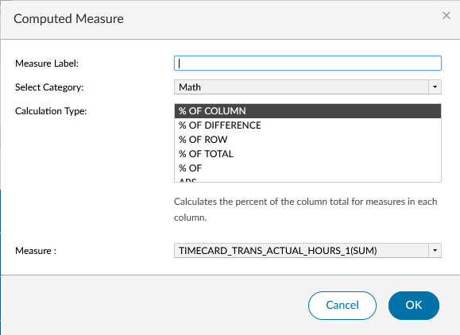

There are several categories to choose from:

- **Advanced...**: Allows the use of some BIRT functions to create a computed measure
- **Logical**: Provides an easy way to generate an IF statement as a computed measure with predefined values for the "Value True" and "Value False". Custom values can also be manually entered by deleting the value in the dropdown and entering your own
- **Math**: Provides many different calculations that can be performed on a measure to create a new measure based on an existing one.
- **Relative Time Period**: Allows working with Date and DateTime fields as a "Time Dimension" to apply a limited set of functions (SUM, COUNT, AVERAGE, MIN, MAX) to a "Data Field"

:::warning

The Relative Time Period category does not work on a non-relative time period RDO.

:::

:::info

The functions available for the **Advanced...** category are limited to only a few functions from the [function list](/docs/birt-studio/advanced/computed-columns#birt-studio-functions). Generally they are limited to some logical functions such as `IF`, `AND`, and `OR`, and mathematical functions such as `MOD`, `ABS`, and others.

:::

Choose a "Calculation Type" from the available list once the category is selected. New options will ask you to select values for the calculation. These values are determined based on predefined values or the columns selected in the RDO. Once everything is selected and you are satisfied with the options, press **OK** to save. The new computed measure will be added to the "Measures" row at the top of the "Interactive Crosstabs" (Analyze) window.

### Totals/Subtotals

While in the "Interactive Crosstabs" view, select **Data > Totals...** from the top menu. This opens the "Totals" menu.

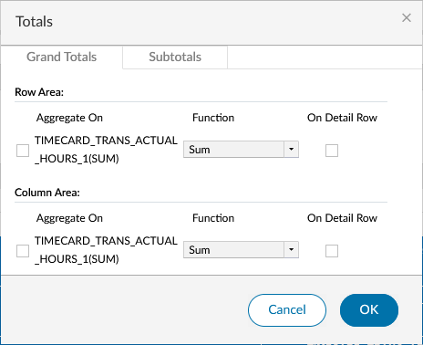

#### Grand Totals

The first tab in the window is called "Grand Totals" and is where you can configure the totals for the entire crosstab report. With a properly configured Crosstab, there should be a "Row Area" and a "Column Area". For each Measure included in the design, one new item is generated for the "Aggregate On" field. You are able to select a function from the dropdown list and choose whether the total appears on the detail row or not. You can check the box to the left of the column key to select it to be added as a total.

Selecting to total something in the Row Area will add a totals row at the bottom of the Crosstab that performs the function selected on each column of data.

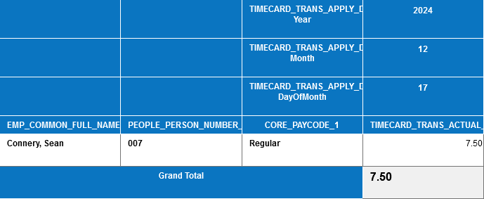

Selecting to total something in the Column Area will add a totals column at the end of the Crosstab that performs the function selected on each row going horizontally across the report.

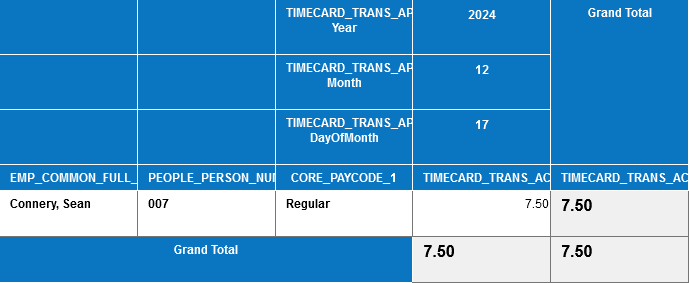

#### Subtotals

The second tab in the "Totals" window is the "Subtotals" tab. This lets you generate subtotals by row and column. This tab also contains a "Row Area" and "Column Area" as before. However, Unlike the grand totals, the number of items that appear is generated differently.

For the Row Area, this is based off of the combinations of Measures and Rows. However, not all Rows are counted in the generation. For example, with Rows Employee Full Name, Employee ID and Paycode Name with Measure Actual Hours, only 2 items are generated.

For the Column Area, this is based off of the combinations of Measures and Columns.

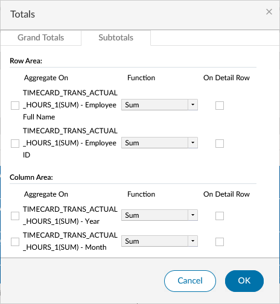

:::info

The total number of items that are displayed may vary than what is stated above depending on the other columns that are included in the the Crosstab and are designated as a Row. The examples provided used limited columns from the RDO to keep the screenshots simple and examples to the point.

:::

:::warning

Applying a subtotal to an item in either area will automatically check off the same subtotal item with the same combination, but for the other Measure. For example, including Actual Hours and Actual Wages as Measures and Employee Full Name and Employee ID as Rows, if you check off the TIMECARD_TRANS_ACTUAL_HOURS_1(SUM) - Employee Full Name subtotal, it will automatically check off the TIMECARD_TRANS_ACTUAL_WAGES_1(SUM) - Employee Full Name subtotal as well.

:::

#### Row Area

Applying a Subtotal to an item in the Row area will create a new row within the existing Crosstab Row that will extend the width of itself up to the Row included in the subtotal item. This is best displayed with pictures.

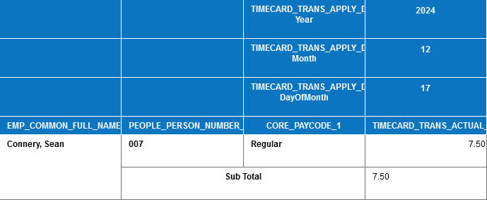

This shows that the item TIMECARD_TRANS_ACTUAL_HOURS_1(SUM) - Employee Full Name was checked off from the Totals window. It extends underneath the other Row items and up to the Employee Full Name Row item.

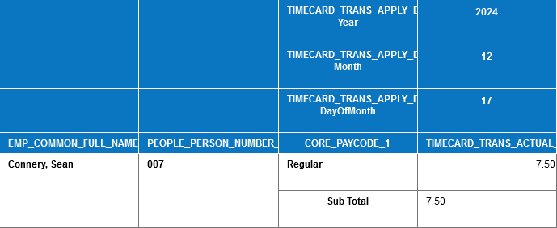

This shows that the item TIMECARD_TRANS_ACTUAL_HOURS_1(SUM) - Employee ID was checked off from the Totals window. It extends underneath the Paycode Name Row and does not go beyond the Employee ID Row item.

#### Column Area

Applying a Subtotal in the Column Area behaves the same way as it does in the Row Area, where the Sub Total column header will extend up to the specified Column.

:::info

How a Subtotal behaves and is displayed in each area will depend on the Rows and Columns that are included. In the example here, we only had Employee ID and Employee Name as Rows. There are countless configurations that could be created and applying a Subtotal will be different depending on your use case.

:::

## Creating a Pivot Table

While in the Interactive Crosstabs viewer, you can create a Pivot Table by selecting **View > Pivot** from the top menu. This will take the current Rows and Columns and swap them. This can be useful if you want to see the data in a different way.

:::info

This is a toggle option. Selecting **View > Pivot** again will return the Rows and Columns to their original positions. Using this option is no different than if you added the Columns as Rows and the Rows as Columns in the Crosstab Builder.

:::

## Setting Crosstab Options

Every Crosstab table has some table options that can be set as well. These options can be found by right clicking the table and selecting "Analyze". From the Interactive Crosstabs window, click the <Wrench className="icon" /> Options icon.

### Measure Header Orientation

The Measure Header Orientation determines the direction that Measure headers will be displayed. The default is Horizontal which will place the Measure header as pictured in the screenshots in this article. Selecting Vertical will put a Measure header underneath the Column headers, one for each Row.

:::tip

Selecting Vertical will most likely not be desired for most reports. However, feel free to experiment and see what works for you.

:::

### Empty Rows and Columns

This option allows you to set how you would like to display empty Rows and empty Columns for the listed Key. Checking either or both boxes will show that empty Row or Column. To tell BIRT what to output in the case of an empty cell, enter a value in the "For empty cells, show" text field.

### Page Break

Page Break allows you to set the row and column interval at which a page break will occur. The default values are 40 and 10, respectively. These can be modified, but could potentially cause clipping if there are too large. The page will break at whichever value is hit first. For example, if you run a report for 30 days for 1 employee and have a date type Column, the Column Interval of 10 will be hit before the Row Interval of 30.

### Display Totals

This controls whether Grand Totals and Subtotals are displayed before or after the end of the data. The default for both is set to "After". Changing this to "Before" for Grand Totals, will cause it to be displayed _above_ the first Row. For Subtotals, the subtotal row will be displayed above the data, but within the Row.

### Drill Size

This controls how far down you are able to expand grouped Rows while viewing the report in Interactive mode. The default value is 2000 and is not recommended to be changed.

### Width

The width option changes how wide each cell is. The default value is 120 pixels. This will most likely be an okay default for most Crosstab reports.

## Getting Additional Help

If you have trouble while building your Crosstab report, please open a case with Support. They will be able to assist you with any issues or questions.

:::warning

While in the Interactive Crosstabs window, there is a **Help** option. This will take you to the BIRT Studio documentation. This can be helpful if you are looking for more information on a specific feature or need help with a specific function. However, the documentation is not specific to the implementation of BIRT Studio within Pro WFM and may not be helpful in all cases.

:::
