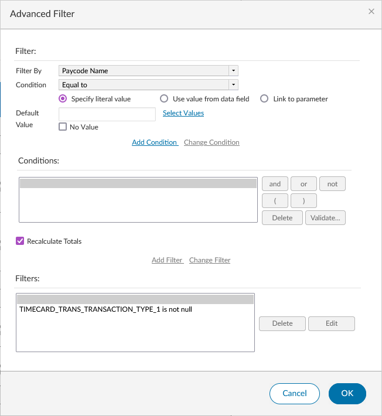
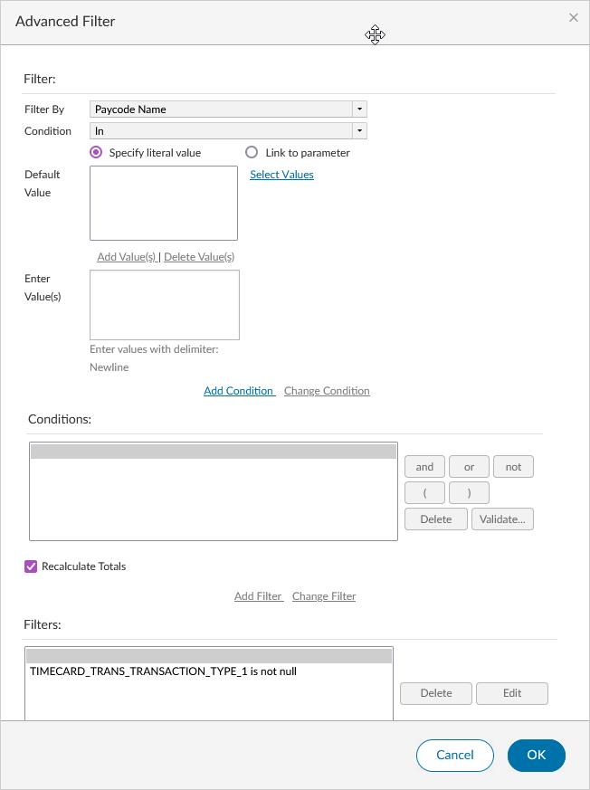
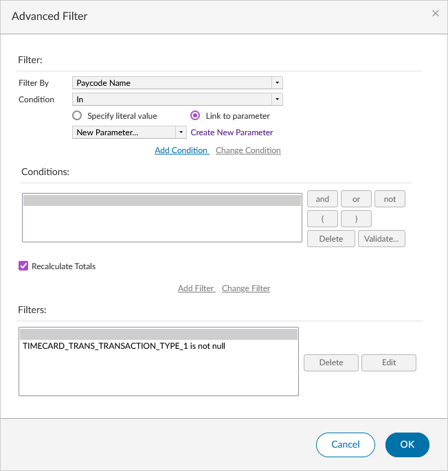
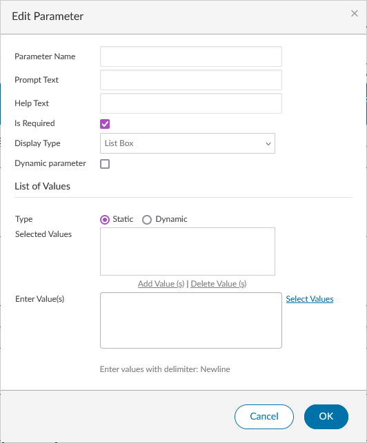
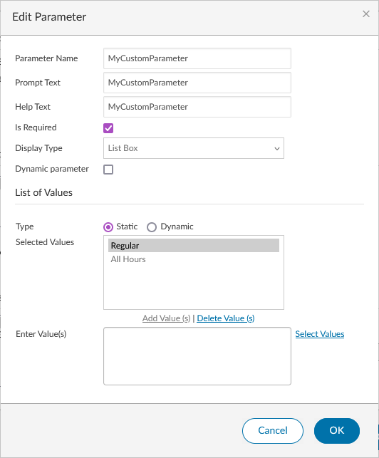
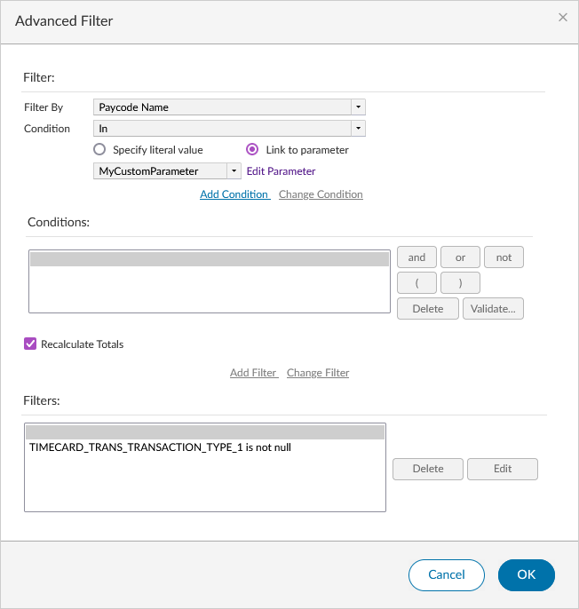
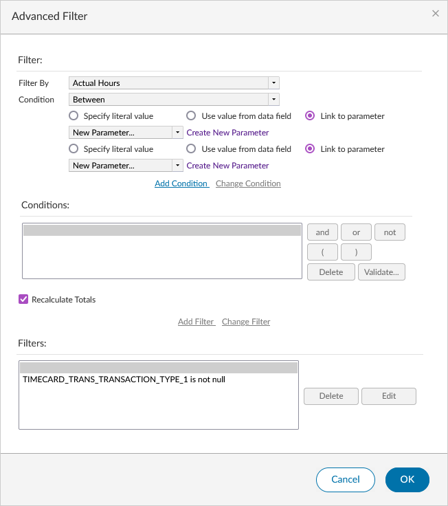
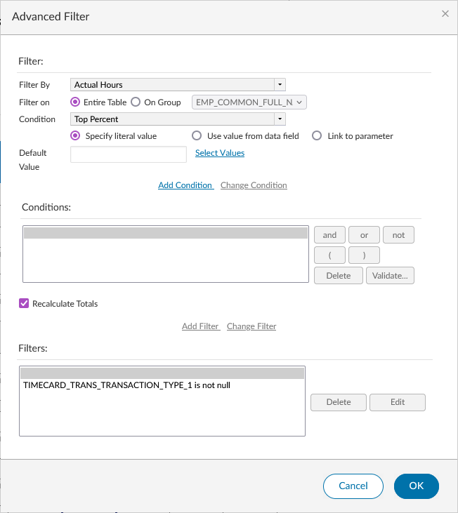

import { Filter, Trash2 } from "lucide-react";

# Creating Custom Report Parameters

## What are Custom Report Parameters?

Custom report parameters are additional user-defined parameters that allow an end-user of the report to tailor that single run of the report. For example, in the "Condensed Employee Time Detail" report, there is a parameter called "Pay Codes". This parameter allows the user to select which pay codes they want to include in the report. A report designer can create this same "Pay Codes" parameter in any report they design (assuming the report is designed in a way that supports this parameter).

A report parameter is simply a filter applied to a column with a specific condition as defined in [Filtering](/docs/birt-studio/customizing-reports/filtering#filter-conditions). When the filter is applied and the report is saved, WFM and BIRT know how to take that parameter and convert it into an input for the user, such as a text box or select area (like with the "Condensed Employee Time Detail Report").

:::info

Since there are so many different ways to create a custom report parameter, the steps in this article will be as complete as possible, without being a complete how-to for any one specific way.

:::

## Creating the Parameter

### Selecting the Column

To get started creating your first parameter, edit the design of your report and select the column that you want to apply the parameter to/apply the filter to and click the <Filter className="icon" /> Filter icon.

:::note

In the examples provided, we're using the Paycode Name column, but you can select whichever column you'd like from your own report.

:::

:::warning

You cannot use Date or DateTime columns as parameters. This is because the built-in Timeframe parameter is a Date type parameter and adding another of this type or similar type will cause conflicts or not work at all.

:::

If your filter window does not look like this, click the *Advanced Filter* link in the top right of the dialog that appears.

### Selecting the Condition

After you've selected your column and have the Advanced Filter window open, from the "Condition" dropdown, select the condition you want.

:::info

Some columns work better than others with different conditions. Transactional data such as hours worked, wages earned, etc. are better suited for conditions that would generate a text input such as "Greater Than", "Less Than", "Equal To", etc. Configurable data such as paycode names, employee names, employee IDs, pay rule names, accrual code names, etc. are perfect candidates for using the "In" condition, though other conditions will work for this type of data too.

:::

:::note

Binary conditions such as "Is Not Null" or "Is Null" do not allow you to link to a parameter

:::

### Linking to the Parameter

Once you have selected your condition, you should see a "Link to parameter" radio button. Select it and then click on "Create New Parameter".

A new window will open called "Edit Parameter".

:::info

Your window may look slightly different than this, depending on the condition you selected.

:::

The 5 inputs that are going to be the same between all conditions are:

- Parameter Name - Set a Parameter Name. This is the behind-the-scenes name that is used when the report is called. Keep the name in either **pascalCase** or **CamelCase**.
- Prompt Text - Set a descriptive name for your Parameter. This is the field that will change how the label above the HTML input appears.
- Help Text - This does not appear to be rendered. This can be set to the same as the Prompt Text.
- Is Required - Can be used to make the parameter optional
- Display Type - Determines the type of HTML input that will be generated.
    - Text Box: Creates a simple text input field that allows for manual text entry
    - Text Box - Auto Suggest: Creates a text input with auto-suggest functionality (Note: the auto suggest functionality does not appear to work. Use Text Box instead.)
    - Combo Box: Creates a dropdown that allows selection of a single item from a predetermined list (configured in the parameter)
    - List Box: Selected with the "In" and "Not In" conditions. Creates a custom element that allows selecting multiple items at once.
    - Radio Button: Creates a list of radio buttons that can be selected at runtime based on the values that are entered.
- Default Value/Enter Value(s) - This is where you will enter the filter value. Default Value will display for all conditions except "In" and "Not In"

:::info

The Display Type is generally selected automatically depending on the condition selected.

:::

:::info

Some Display Types appear to set their own Prompt Text that is not changed based on what is configured.

:::

:::warning

Using special characters in the Parameter Name is allowed but is not best practice. Stick to the suggestion provided and use **pascalCase** or **CamelCase**.

:::

:::warning

Dynamic parameters are not supported with the current implementation of BIRT Studio. Selecting any checkbox or radio button that changes the type from "Static" to "Dynamic" or makes the Parameter a "Dynamic parameter" will not work

:::

After entering the value(s), click OK to save the changes. If you are using the "In" or "Not In" conditions, be sure to click "Add Value(s)" before clicking OK.

## Add the Parameter as a Filter

After the Parameter is linked and created, the "Advanced Filter" window should still be open. However, the dropdown that previously said "Create New Parameter" should now be filled with the name of your Parameter.

Once this window is open and the Parameter is linked, click "Add Condition" followed by "Add Filter" and then OK to save all changes.

:::warning

A common "gotcha" is that users will forget to click the "Add Filter" link after clicking "Add Condition". This will not save the filter as a parameter and will not complete the process.

:::

## Viewing and Previewing the Results

Once the filter is saved, the report design will refresh and the Save icon will be visible (if previous changes were already saved). From here, you are able to preview the report by clicking the Preview button, specifying the desired parameters and clicking OK.

The report will run with the provided parameters in a new tab as if the report was being run from the Report Library in Interactive mode.

## Deleting a Parameter

If you mess up making a custom parameter or want to start over:

1. Delete the Filter by clicking the <Filter className="icon" /> filter icon, selecting the filter that corresponds to your Parameter and click Delete. Then click OK.
2. Delete the Parameter by navigating to **Data > Manage Parameters**, finding the Custom Parameter name and clicking the <Trash2 className="icon" /> delete icon.

:::info

You can do these out of order, but if you delete the Parameter first and go to delete the filter, you won't see the Parameter name anymore. Instead, you'll see some filter condition based on the condition you selected and the value(s) you entered into the parameter. They get brought out and entered into a new filter when the Parameter is deleted.

:::

## Appendix A: Filter Conditions

Some of the filter conditions have additional configuration required or specific nuances that were not explained in the main article. The information provided in the headings below is the same for the positive and negative condition (e.g. between vs not between).

All [filter conditions](/docs/birt-studio/customizing-reports/filtering#filter-conditions) are described in another article if you are unsure of how each one works.

### Between

Between is a little different because it requires setting two values instead of just one. This condition works well with:

- Numeric data

When creating a parameter using this condition it is a good idea to keep this in mind and only create a parameter that links to a numerical piece of data such as hours or wages.

This condition will use a "Text Box" Display Type by default when creating a parameter. This can be changed to any other type except "List Box". For example, to create a parameter that allows the user to specify a predefined amount, use "Combo Box" or "Radio Button". To allow the end-user to specify any value, use "Text Box".

Link the same parameter twice to have the same values listed at runtime for the upper and lower values.

### Like

The Like condition is used to filter data based on a pattern. This condition works best with text data, but could work with numerical data as well.

When creating a parameter using this condition, it is a good idea to keep this in mind and only create a parameter that links to a text-based piece of data such as pay code names, employee names, etc. This condition will work for numerical data if needed and no other condition fits the requirements, but usually "Like" will not be used for numerical data.

### Match

No, really -- how does Match work?

### Top Percent/n & Bottom Percent/n

The Top Percent/n and Bottom Percent/n conditions are only available with numerical data only. When selecting one of these conditions, a new field is available called "Filter on" that allows the user to filter on the entire table or on a specified group.

This condition will use a "Text Box" Display Type by default when creating a parameter. This can be changed to any other type except "List Box". For example, to create a parameter that allows the user to specify a predefined percentage, use "Combo Box" or "Radio Button". To allow the end-user to specify any value, use "Text Box".

## Appendix B: Reserved Parameter Names

When you create a Parameter with a specific name, the application is designed to handle that a certain way. For example, creating a Paycode Parameter with the name "PaycodeType" exactly like this will create a Parameter that links to every single configured Paycode in the application. This includes both Regular and Combined Paycodes. The application will do this, regardless of the values you enter into the "Enter value(s)" field (when using the "In" or "Not In" condition). These are also called "Parameter Lists"

The list of Parameter Lists can be found by clicking "Edit" on any Published Report, selecting a parameter and clicking "Edit". An "Edit Report Parameter" window will open that contains a table of the reserved Parameter names with the corresponding "Parameter List"

- PaycodeType
- PayCode
- Exceptions
- audittype
- secrtyaudittype
- peopleaudittype
- att_events
- att_combined_events
- att_patterns
- att_lost_time_events
- att_actions
- att_policies
- att_other
- ExceptionType
- Paycodes
- HourType
- AbsenceType
- Hours Summaries
- supportusersecurityaudittype

## Appendix C: FAQ

Since there are many ways to create a custom parameter, please find in this section some common questions related to creating custom report parameters that were not able to be covered above.

### Why does my report preview only show one value when I added multiple?

If this is happening to you, you most likely selected the "In" or "Not In" Condition when you [selected your condition](#selecting-the-condition).

In the "Edit Parameter", after adding your values and clicking "Add Value(s)", in the "Selected Values" text area, only one would be highlighted. This is the value that will appear when previewing the report. To see the other values, you can either <kbd>Ctrl + Click</kbd> the other "Selected Values" you want to appear which will highlight multiple, and then click OK, or run the report from the Report Library which will return the correct selected values at runtime.

### Why is my custom report parameter not appearing when I run my report from the Report Library?

This is a [known issue](/docs/birt-studio/known-issues#custom-report-parameter-not-showing).

